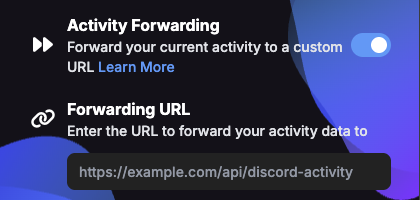

# Activity Forwarding

PreMiD's Activity Forwarding feature allows you to send your current activity data to a custom URL endpoint. This can be useful for integrating PreMiD with other applications or services.

## Enabling Activity Forwarding

1. Open the PreMiD extension popup
2. Go to Settings
3. Toggle on "Activity Forwarding"
4. Enter the URL where you want to forward your activity data



*The Activity Forwarding setting can be found in the extension's settings page.*

## Data Format

When activity forwarding is enabled, PreMiD will send a POST request to your specified URL whenever your activity changes or is cleared. The request body is in JSON format.

### Activity Data

When an activity is active, the following data is sent:

```json
{
  "active_activity": {
    "application_id": "503557087041683458", // PreMiD's client ID or the activity's client ID
    "name": "YouTube", // The name of the service
    "service": "unknown", // The name of the service (currently set to "unknown")
    "api_version": 0, // The API version of the service (will be populated in future updates)
    "type": 0, // Activity type (0 = Playing, 1 = Streaming, 2 = Listening, 3 = Watching, 5 = Competing)
    "details": "Watching a video", // Optional - First line of the activity
    "state": "Video title", // Optional - Second line of the activity
    "timestamps": { // Optional - Timestamps for the activity
      "start": 1619712000000, // Unix timestamp in milliseconds
      "end": 1619715600000 // Unix timestamp in milliseconds
    },
    "assets": { // Optional - Images for the activity
      "large_image": "https://example.com/logo.png", // Large image key
      "large_text": "YouTube", // Text shown when hovering over the large image
      "small_image": "https://example.com/play.png", // Small image key
      "small_text": "Playing" // Text shown when hovering over the small image
    },
    "buttons": [ // Optional - Up to 2 buttons
      {
        "label": "Watch", // Button text
        "url": "https://youtube.com/watch?v=..." // Button URL
      }
    ]
  },
  "extension": {
    "version": "2.3.0", // Extension version
    "user_id": "123456789012345678", // Discord user ID (if connected) or null
    "api_version": 1 // API version of the activity forwarding feature
  }
}
```

### Clearing Activity

When an activity is cleared, the following data is sent:

```json
{
  "active_activity": null,
  "extension": {
    "version": "2.3.0", // Extension version
    "user_id": "123456789012345678", // Discord user ID (if connected) or null
    "api_version": 1 // API version of the activity forwarding feature
  }
}
```

## Example Implementation

Here's a simple example of a Node.js server that receives activity data:

```javascript
const express = require('express');
const app = express();
const port = 3000;

app.use(express.json());

// Store the last activity update time and a timeout reference
let lastActivityTime = 0;
let activityTimeoutId = null;
let currentActivity = null;

// Function to handle activity timeout (20 minutes)
function setupActivityTimeout() {
  // Clear any existing timeout
  if (activityTimeoutId) {
    clearTimeout(activityTimeoutId);
  }

  // Set a new timeout for 20 minutes (1200000 ms)
  activityTimeoutId = setTimeout(() => {
    if (Date.now() - lastActivityTime >= 1200000) {
      console.log('Activity timed out after 20 minutes of inactivity');
      currentActivity = null;
      // Here you would typically update your application state or notify other systems
    }
  }, 1200000);
}

app.post('/api/discord-activity', (req, res) => {
  const { active_activity, extension } = req.body;

  console.log('Received activity data:');
  console.log('Extension version:', extension.version);
  console.log('User ID:', extension.user_id);
  console.log('API version:', extension.api_version);

  // Update the last activity time
  lastActivityTime = Date.now();

  if (active_activity) {
    console.log('Activity:', active_activity.name);
    console.log('Service:', active_activity.service);
    console.log('API Version:', active_activity.api_version);
    console.log('Details:', active_activity.details);
    console.log('State:', active_activity.state);

    // Store the current activity
    currentActivity = active_activity;

    // Set up the timeout for activity clearing
    setupActivityTimeout();
  } else {
    console.log('Activity cleared');
    currentActivity = null;

    // Clear the timeout since activity was explicitly cleared
    if (activityTimeoutId) {
      clearTimeout(activityTimeoutId);
      activityTimeoutId = null;
    }
  }

  res.status(200).send('OK');
});

app.listen(port, () => {
  console.log(`Activity receiver listening at http://localhost:${port}`);
});
```

## Limitations

- The endpoint must respond within 5 seconds to avoid timeouts
- Activity data is only sent when it changes or is cleared
- If the extension is disabled or the browser is closed, no "clear" message will be sent

## Activity Timeout

If no activity updates are received for 20 minutes (for example, when the user closes their browser), the activity should be considered cleared. Your implementation should handle this timeout scenario by automatically clearing the activity status after 20 minutes of inactivity.
